# Weather App

Weather App is a cross-platform mobile application built with .NET MAUI. It allows users to search for locations, view current weather information, and inspect weather forecasts using external geocoding and weather APIs.

## Features

- Search for cities by name.
- Select locations from an interactive map.
- Resolve coordinates into readable locations.
- Display current weather and forecast data.
- Show weather-specific icons and backgrounds.
- Navigate between home, search, results, settings, and location popup views.
- Support light and dark theme preferences.

## Screenshots

### Dark Mode

| Home | Search | Map Location |
|---|---|---|
| 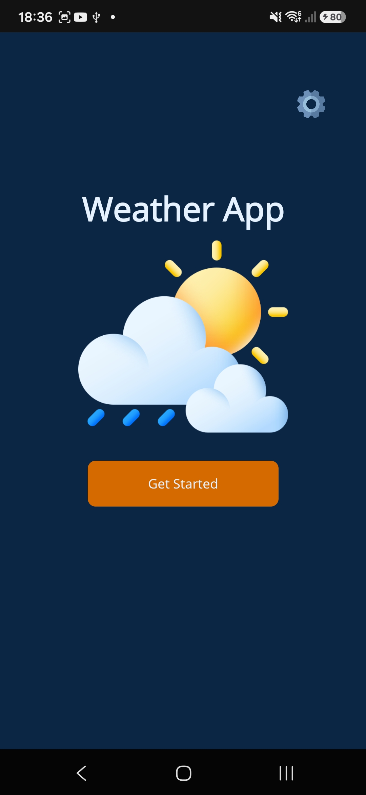 | 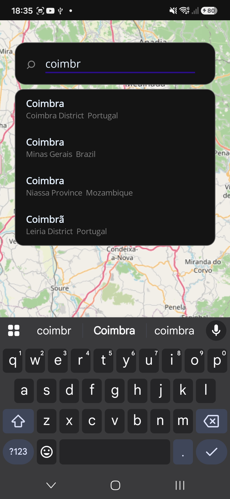 | 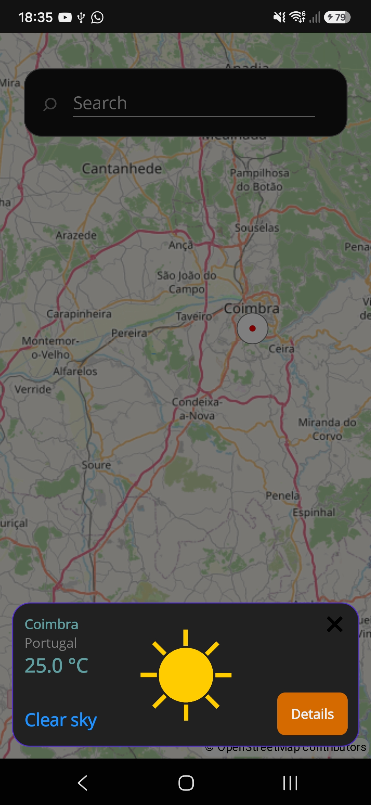 |

| Results | Settings | Error |
|---|---|---|
| 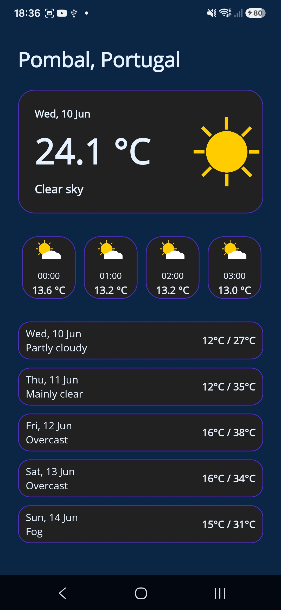 | 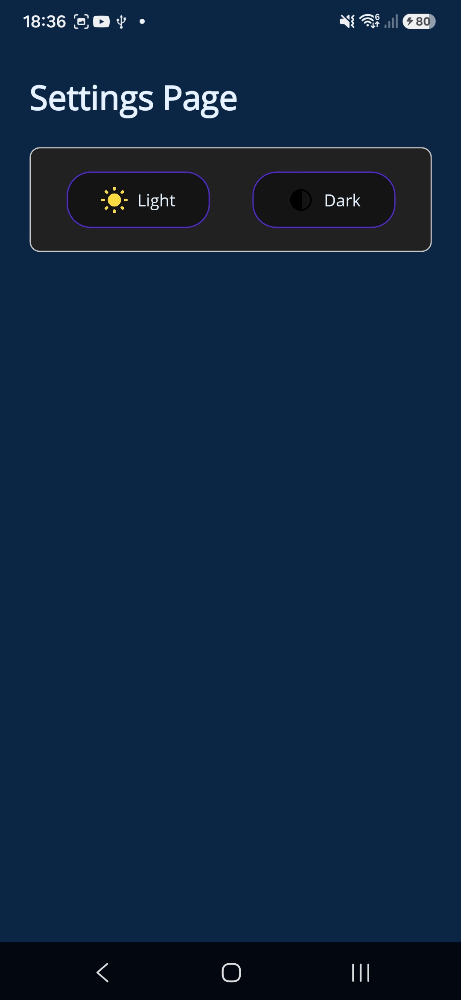 | 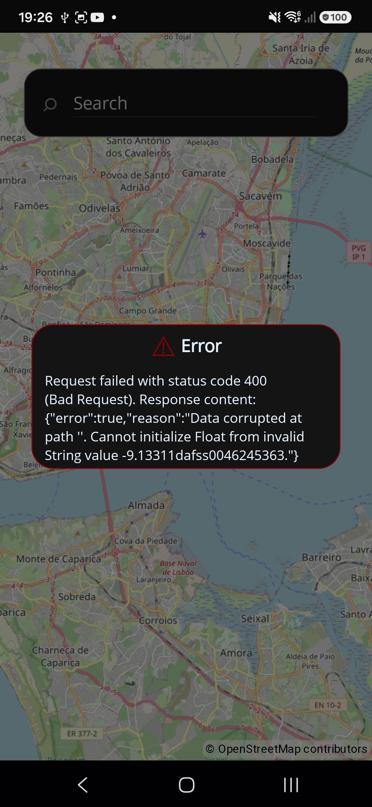 |

### Light Mode

| Home | Search | Map Location |
|---|---|---|
| 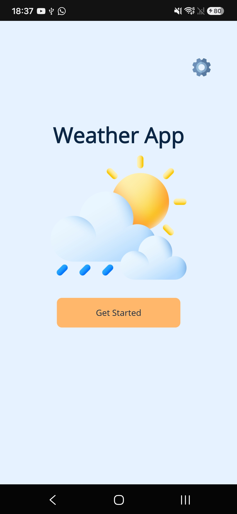 | 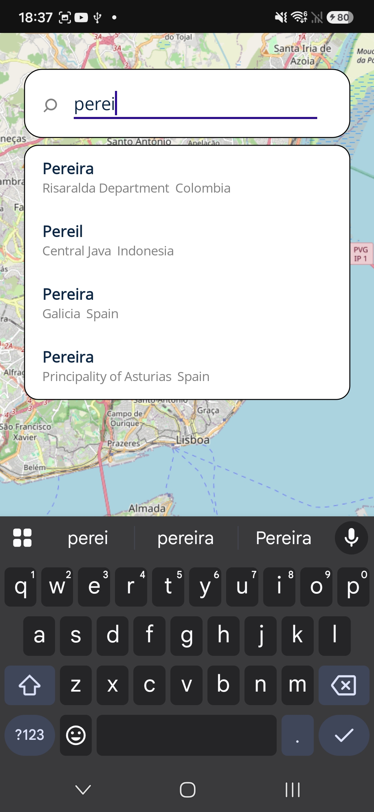 | 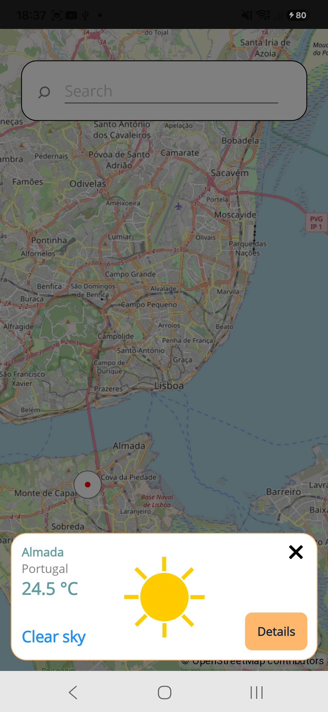 |

| Results | Settings | Error |
|---|---|---|
| 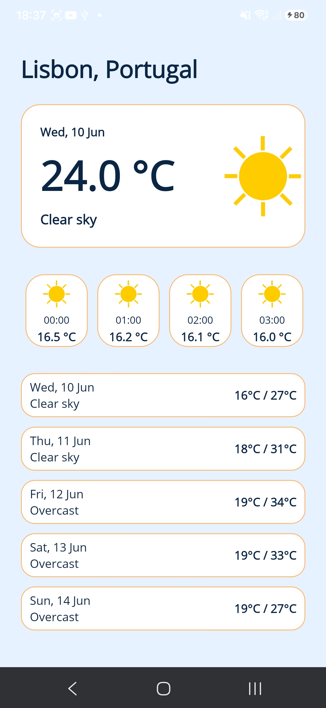 | 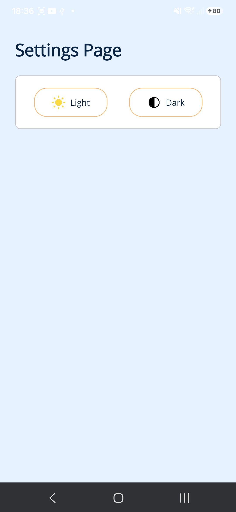 | 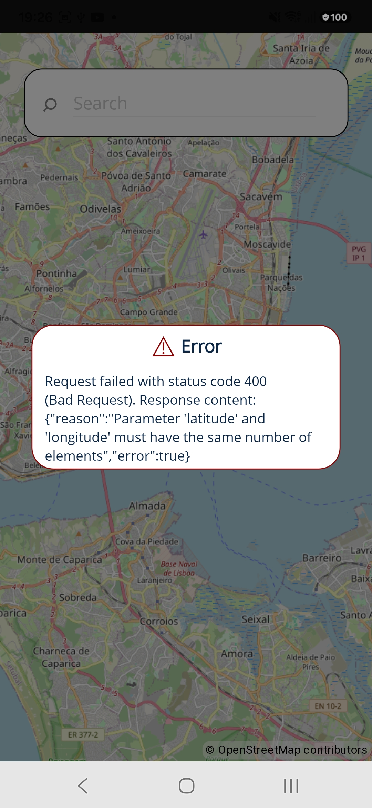 |

## Tech Stack

- .NET 10
- .NET MAUI
- C#
- XAML
- MVVM architecture
- Dependency Injection through `MauiProgram.cs`

## Libraries Used

- `Microsoft.Maui.Controls` - core .NET MAUI UI framework.
- `Microsoft.Extensions.Logging.Debug` - debug logging during development.
- `CommunityToolkit.Maui` - MAUI toolkit extensions and UI helpers.
- `CommunityToolkit.Mvvm` - MVVM helpers such as `ObservableObject`, `[ObservableProperty]`, and `[RelayCommand]`.
- `Mapsui.Maui` - map-related MAUI support.
- `SkiaSharp.Views.Maui.Controls.Hosting` - required by map/rendering dependencies used through Mapsui.

## External APIs

The application uses public API endpoints defined in `Constants/ApiConstants.cs`:

- Open-Meteo Forecast API: `https://api.open-meteo.com/v1/forecast`
- Open-Meteo Geocoding API: `https://geocoding-api.open-meteo.com/v1/search`
- Open-Meteo Reverse Geocoding API: `https://geocoding-api.open-meteo.com/v1/reverse`
- OpenStreetMap Nominatim Reverse API: `https://nominatim.openstreetmap.org/reverse`

## Project Structure

```text
WeatherApp/
|-- Constants/       API endpoint constants
|-- DTOs/            Data transfer objects for external API responses
|-- Helpers/         Shared helpers, app settings, weather descriptions, and error handling
|-- Mappers/         Conversion logic from DTOs to domain models
|-- Models/          Application domain models
|-- Services/        API, navigation, geocoding, weather, and popup services
|-- ViewModels/      MVVM view models and UI state
|-- Views/           XAML pages, popups, and UI components
|-- Resources/       Images, fonts, styles, app icon, and splash screen
|-- Platforms/       Android and iOS platform-specific configuration
```

## Setup Instructions

### Prerequisites

- Visual Studio or another compatible IDE with the .NET MAUI workload installed.
- .NET 10 SDK.
- Android SDK/emulator for Android development.
- macOS with Xcode for iOS builds, if targeting iOS.

### Clone the Repository

```bash
git clone https://github.com/rolistoli/WeatherApp.git
cd WeatherApp
```

If the solution file is one directory above this project, open the solution from the repository root. Otherwise, open `WeatherApp.csproj` directly in Visual Studio.

### Restore Dependencies

```bash
dotnet restore
```

### Build the Project

For Android:

```bash
dotnet build -f net10.0-android
```

For iOS:

```bash
dotnet build -f net10.0-ios
```

### Run the App

The simplest option is to run the project from Visual Studio using an Android emulator, a physical Android device, or an iOS simulator.

You can also run from the command line by selecting the target framework and device runtime supported by your environment.

Example for Android:

```bash
dotnet build -t:Run -f net10.0-android
```

## Android Permissions

The Android manifest includes:

- `android.permission.INTERNET`
- `android.permission.ACCESS_NETWORK_STATE`

These permissions are required because the app fetches weather and geocoding data from remote APIs.

## Architectural Decisions

### MVVM Pattern

The app follows the MVVM pattern:

- Views contain XAML layout and visual behavior.
- ViewModels expose UI state and commands.
- Models represent application data.
- Services handle API calls, navigation, and shared operations.

This keeps UI code separate from business logic and makes the app easier to maintain.

### Dependency Injection

Services, pages, and view models are registered in `MauiProgram.cs`. This centralizes object creation and keeps dependencies explicit.

Registered services include:

- `IGeocodingService`
- `IWeatherService`
- `INavigationService`
- `HttpClient`

### Service Layer

API communication is isolated in services:

- `WeatherService` handles forecast and current weather requests.
- `GeocodingService` handles city search and reverse geocoding.
- `AppNavigationService` handles page navigation and modal popup presentation.

This avoids putting API or navigation logic directly inside the views.

### DTO to Model Mapping

External API response objects are stored in `DTOs/`, while app-facing models are stored in `Models/`. Mapping is handled in `Mappers/WeatherMapper.cs`.

This protects the rest of the application from changes in external API response formats.

### Centralized Error Handling

API failures are normalized through helper classes such as `ApiException` and `ApiErrorHandler`. ViewModels use the base view model error flow to display user-facing error popups.

### Shared App Preferences

Theme and application preferences are handled through `Helpers/AppSettings.cs`, allowing the app to apply saved settings when it starts.

## Notes

- The app depends on an active internet connection.
- No API key is required for the current public API integrations.
- The project currently targets Android and iOS through `net10.0-android` and `net10.0-ios`.
